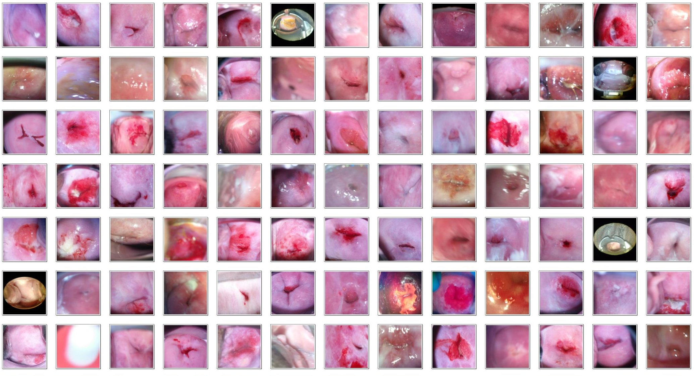
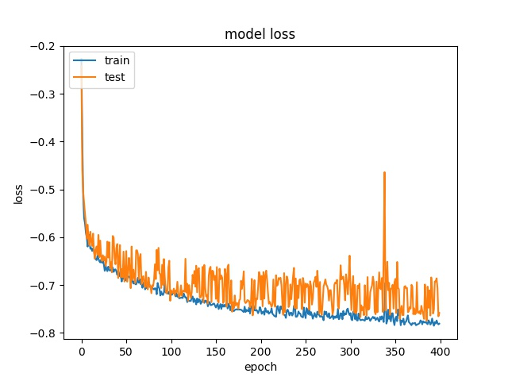

# Cervix ROI Segmentation Using U-NET
 
## Overview
This code illustrate how to segment the ROI in cervical images using U-NET. 

The ROI here meant to include the: Os + transformation zone + nearby tissue.

The localized ROI is supposed to improve the classification of cervical types, which is the challenge in the Kaggle competition:[Intel and MobileODT Cervical Cancer Screening](https://www.kaggle.com/c/intel-mobileodt-cervical-cancer-screening) 

**Compare to other UNET examples, in this one we got:**   
 - the input images in RGB 
 - the input images and masks are augmented in pairs using izip ImageDataGenerators
 - support both Tensorflow and Theano backend, and is using Keras 2

**Dependencies:**
- Keras 2
- Tensorflow or Theano
- cv2

**Other references:**
- Thanks to [Paul](https://www.kaggle.com/c/intel-mobileodt-cervical-cancer-screening/discussion/31565), who annotated the bounding box here: [Bounding boxes for Type_1](https://www.kaggle.com/c/intel-mobileodt-cervical-cancer-screening/discussion/31565). I have made some minor adjustments and added the missing images.   
- The amazing Keras UNET implementation by jocicmarko in: [ultrasound-nerve-segmentation](https://github.com/jocicmarko/ultrasound-nerve-segmentation)
- The original U-Net design:  [U-Net: Convolutional Networks for Biomedical Image Segmentation](http://lmb.informatik.uni-freiburg.de/people/ronneber/u-net/).
    
   
---
## Usage

**Data preparation:**
- Download the [data from Kaggle](https://www.kaggle.com/c/intel-mobileodt-cervical-cancer-screening/data). 
- Unzip `trian.7z` and `test.7z` into input folder. You may unzip `additional_Type_*_v2.7z` as well, if you want to segment them, its optional.
- The input folders should look like this:
  - input/test/
  - input/train/Type_1
  - input/train/Type_2
  - input/train/Type_3
  - input/additional/Type_1  (optional)
  - input/additional/Type_2  (optional)
  - input/additional/Type_3  (optional)
- Run `prepare_data.py`
- Run `split_data.py`
- Note:
    - The bbox annotations were converted to Sloth json format and is included under `input/*.json`.
    - The additional data is NOT used in this training.

**Training:**
- Run `train.py`
- The best epoch weight file will be save under `src/unet_xxxxxx/weights.h5`. Note when `train.py` starts, it will look for previous weight file (if any) and resume from there if weight file exits

**Segmentation:**
- Run `predict.py`
- The output segmentations are under:
    - input/test_roi/
    - input/train_roi/
    - input/additional_roi/
    
**Configurations:**
- Customize `configurations.py`
   
---
## Results
On a GTX 1070, the training of 400 epochs took ~2 hours to complete. The best DICE coefficient is ~0.78. 

Apply this model to the 512 unseen test images, the result looks satisfactory in 96% of images.

Sample outputs:

Training loss:

